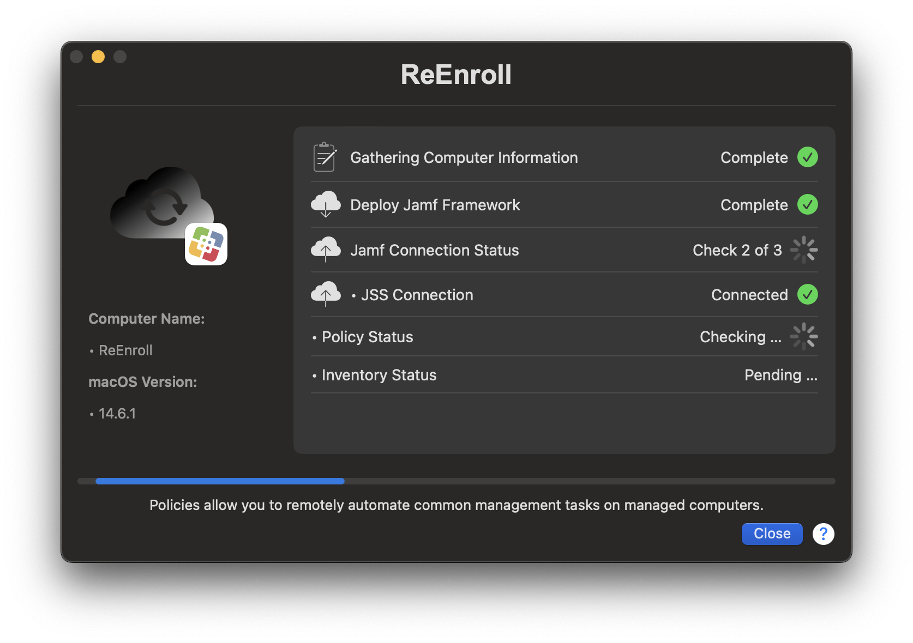

# ReEnroll

&nbsp;&nbsp;

   

ReEnroll is designed to automate the re-enrollment process of devices into Jamf Pro. It is particularly useful in situations where the Jamf managed local administrator password is not correct, and it needs to be updated in Jamf Pro, or when other re-enrollment scenarios arise, such as updating device inventory or reassigning devices to different sites.

Features

    - Redeploy the Jamf Framework silently or with Dialog window to keep the end user informed on progress.
    - Jamf Pro re-enrollment: ReEnroll the device into Jamf Pro using an enrollment invitation.
    - Renew Profiles to re-enroll the device to your Jamf Pro instance.
    - Policy Check: Validates the policy status to ensure successful re-enrollment.
    - Inventory Check: Validates the inventory status to ensure successful re-enrollment and valid device signature, if re-enrolled.
    - LAPS Account Status Check: Integrates with Jamf Pro to validate the local administrator password status (LAPS) and update it if necessary.
    - Automatic Site Assignment: Reassigns devices to the correct site during the enrollment process by site ID.
    - Move Computers to a different site after enrollling by site ID.
    - Delete Specific Accounts: You can target specific user accounts to delete.
    - Send a Teams or Slack message after the script runs.

Prerequisites

    If using the redeploy Jamf Framework command, you must setup an ReEnroll API account with the following privileges:
        - Read Computer Inventory Collection
        - Read Computer Check-In 
        - Update Computers 
        - Read Computers 
        - Read Sites 
        - Flush MDM Commands 
        - Flush Policy Logs 
        - Update Computer Inventory Collection 
        - View Local Admin Password 
        - Send Computer Remote Command to Install Package 
        - Send Local Admin Password Command
    
    Enrollment Invitation: You will need an enrollment invitation token, which can be generated from Jamf Pro.
   
